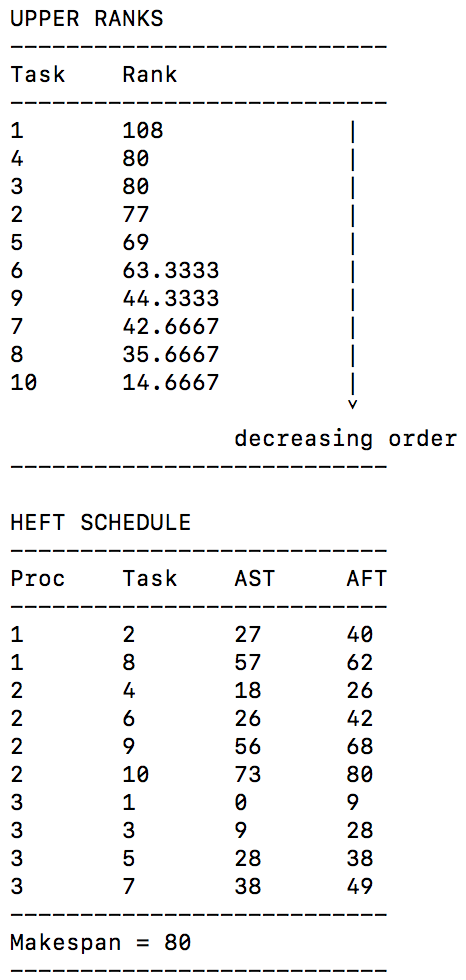
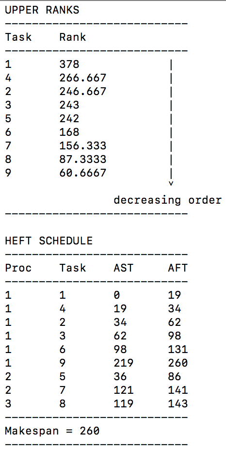

# CPU Scheduler

A cpu scheduler that uses the HEFT algorithm, which is an insertion-based policy, to minimize the finish times of the given tasks on a bounded number of heterogenous processors.

## Paper

Read more about the project and implementation details [here](https://github.com/samanjate/heft/blob/master/documentation/cpu-scheduler-implementation.pdf).

## Video

Watch how the code works [here](https://youtu.be/h3rks2PvXHE).

## Getting Started

To get you a copy of the project up and running on your local machine for development and testing purposes, please follow the steps provided.

### Prerequisites

Please make sure your system has `gcc` and `python` (preferably 2x) installed. You can verify by using the following commands.

```
$ gcc --version
```

```
$ python --version
```

### Installing

You will first need to clone the project to your local system. You can do this by using the following command. This shall prompt you to enter your username and password. You will need the necessary permissions to perform this step.

```
$ git clone https://github.com/Summer18CS5600/finalproject-cpu-scheduler.git
```

## Compiling and running the examples

Change your directory to the git repository using

```
$ cd path/to/the/repository/finalproject-cpu-scheduler
```

You can now use the python files provided to compile and run the examples.

```
$ python compile.py
$ python run.py
.......
.....
...
.
```

While the code is designed to work across all platforms, the python files for compiling and running the programs are for linux-based systems. If you are on Windows, please use the `gcc heft.c -o heft` to create the excutable named `heft`. This executable will take a DAG as an argument. Please find DAG examples in the `examples` folder.

### Output

You should see outputs for the two examples as follows.

|  |  |
|:---:|:---:|
| output for example 1 | output for example 2 |

### Format of the examples

The input format takes in two numbers, the number of tasks(N) and the number of processors(M). This is followed by a NxM matrix representing the compuation costs of the tasks(represented by row number) on a processor(represented by the column number). This is followed by a NxN matrix representing the communication cost from one processor to another, in case the following task were to be scheduled on a different processor.

```
N M
. . . ← M columns
.
.
.
.
.
↑	
N rows
. . . . . . ← N columns
.
.
.
.
.
↑
N rows
```

The following DAG and computation table can be represented as follows in example 1.

 

### Running custom input

You can create your own DAG and computation table as per the aforementioned format. To run your input, simple save the input file with `name_of_you_file` in the examples folder. Then you can add `os.system('./heft ./examples/name_of_you_file')` at the end of `run.py` file. Simply compile and run. You should see the result of your input. 

Note: the first argument of the program should be the correct path to your input file with the proper name and extension.

There is a random graph generator provided to you for getting started

## References

* [Performance-effective and low-complexity task scheduling for heterogeneous computing](http://ieeexplore.ieee.org/xpls/abs_all.jsp?arnumber=993206) by *Topcuoglu, Haluk; Hariri, Salim Wu, M.*.  IEEE Transactions on Parallel and Distributed Systems 2002
* [HEFT Wikipedia](http://en.wikipedia.org/wiki/Heterogeneous_Earliest_Finish_Time)
* Python implementation of HEFT on [github](https://github.com/mrocklin/heft)
